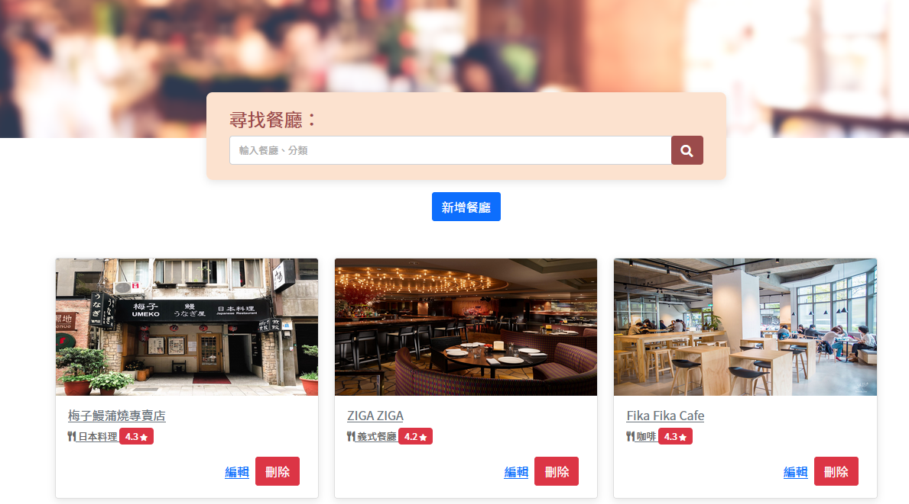

# 我的餐廳清單



## 這是什麼
* 一個餐廳瀏覽網站，可以在首頁瀏覽餐廳的名稱、種類與評價。
* 可以點選有興趣的店家，以查看`詳細資訊`。
* `詳細資訊`包含：
  * 類別
  * 地址
  * 電話
  * 餐廳簡述
* 可以自行新增自己喜歡的餐廳至頁面

## 環境建置與需求 (prerequisites)
 * [Node.js](https://nodejs.org/en/): v15.11.0
 * [MongoDB](https://www.mongodb.com/try/download/community): v4.2.13

## 專案啟動方式
  1. 下載專案壓縮檔或使用git clone至個人電腦
  ```bash
    git clone https://github.com/stylelinz/restaurant-list-express.git
  ```
  2. 進入專案資料夾，在終端機輸入以下指令
  ```bash
    cd movie-list-express
  ```
  3. 安裝npm套件，在終端機輸入以下指令
  ```bash
    npm install
    npm i nodemon
  ```

  4. 在終端機輸入以下指令新增種子資料
  ```bash
    npm run seed
  ```

  5. 啟動伺服器，執行 app.js 檔案，輸入以下指令
  ```bash
    npm run dev
  ```

  6. 當終端機出現以下字樣，表示伺服器與資料庫已啟動並成功連結，可以在瀏覽器觀看 http://localhost:3000
  ```bash
    Express is listening on http://localhost:3000
  ```

  7. 在終端機按下 `ctrl` + `c` 或 `cmd` + `c`，以關閉伺服器